# Introducción a WCF con GTK# y MonoDevelop
		

<b>Windows Communication Foundation (WCF)</b> es un framework que soporta aplicaciones orientadas a servicios con herramientas que facilitan la construcción y el consumo de servicios independientes de la plataforma, proporciona un modelo unificado de programación para aplicaciones distribuidas con tecnologías como: Web Services, Remoting, COM, DCOM, WSE, MSMQ,etc. 

Este modelo está enfocado a desarrollar servicios orientados a procesos de negocio que los clientes pueden acceder y utilizar sin conocer los detalles de su implementación.
Los beneficios de las aplicaciones orientadas a servicios son:

<ol>
<li>Los servicios independientes actúan como bloques de construcción que pueden reutilizarse para la construcción de nuevas aplicaciones o servicios.</li>
<li>Las aplicaciones en este contexto están totalmente desacopladas de los procesos de negocio y se convierten únicamente en interfaces de usuario (UI) que hacen uso de los servicios, además pueden o no estar construidas con las mismas herramientas de programación que el servicio.</li>
<li>El éxito depende más de los procesos de negocio que de la tecnología.</li>
<li>Los servicios son un grupo de métodos que comparten funcionalidades, esto permite que las aplicaciones respondan a los requerimientos cambiantes sin que se desarrollen desde cero esos requerimientos.</li>
</ol>

En este contexto WCF tiene dos niveles:

<ol>
<li>A nivel lenguaje de programación se ve como un sistema compuesto por objetos persistentes, reglas de negocio que pueden estar en objetos de .NET o en store procedures y una interfaz de negocio que expresa las operaciones del servicio en donde se revisan las precondiciones de cada operación, se ejecutan las actividades del negocio y se regresa un resultado para el consumidor del servicio.</li>
<li>A nivel servicio se tienen operaciones que pueden ser similares a las funciones a nivel lenguaje pero que son diseñadas para ser parte del servicio. Estas operaciones combinan varias funciones a nivel lenguaje y probablemente utilicen tipos de datos más acorde con ambientes distribuidos.</li>
</ol>

WCF proporciona funcionalidad a una amplia audiencia de clientes distribuidos que no comparten un mismo espacio de direcciones, estos clientes utilizan el servicio mediante una clase proxy. Los clientes y los servicios se comunican intercambiando mensajes que no están limitados a un conjunto particular de protocolos.

Las aplicaciones orientadas a servicios es un concepto relativo al estilo de la aplicación y a la granularidad de los servicios.

Toda la información necesaria para los clientes: qué es lo que el servicio hace, como debe ser accedido, en qué lugar está disponible, etc. WCF lo encapsula en un concepto llamado <b>EndPoint</b>, que es  básicamente una combinación de address, binding y contract (lo que comúnmente se conoce como el ABC de WCF).

Un servicio WCF consta de los siguientes elementos:

<ol>
<li>Un service host que proporciona el runtime para activar el servicio Web, los hay en tres tipos: Internet Information Services (IIS), Windows Activation Services (WAS) and selfhost managed applications.</li>
<li>El contrato del servicio que es una interfaz a nivel lenguaje de programación que define las operaciones que serán expuestas a través del endpoint.</li>
<li>Clases ordinarias o componentes de .NET que implementan toda la lógica de negocios.</li>
</ol>

Hay tres componentes básicos para la creación de un servicio en WCF.

<ul>
<li>(a) El servicio WCF</li>
<li>(b) El service host</li>
<li>(c) El cliente</li>
</ul>

Como ejemplo, para la creación de cada uno de estos componentes, voy a programar una aplicación GTK# que recibe un número entero, manda la petición al servicio y finalmente recibe su representación binaria como una cadena.

<h1><b>Tarea 1: Creación del servicio WCF</b></h1>

1-. Ejecuta MonoDevelop y crea una nueva solución del tipo <b>“Blank Solution”</b> con el nombre <b>“Samples.MyFirstWCF”</b>.

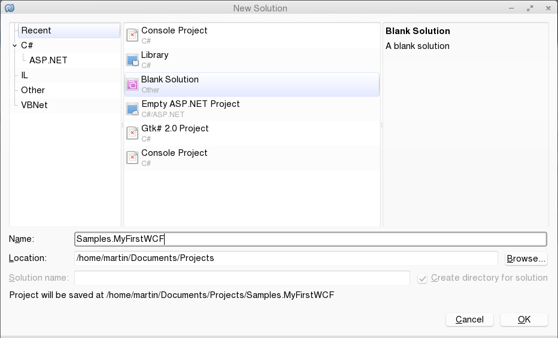

 

2-.A la solución <b>“Samples.MyFirstWCF”</b> agrega un proyecto del tipo <b>“Library”</b> con el nombre “Samples.MyFirstWCF.DisplayBitsService”.

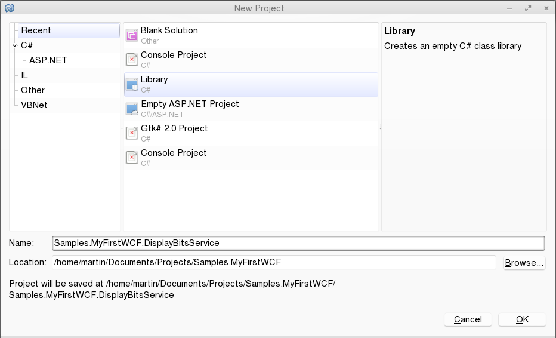

 

3-. Al proyecto <b>“Samples.MyFirstWCF.DisplayBitsService”</b> agrega los siguientes elementos:

<ol>
<li>Una interface con nombre <i><b>IDisplayBitsServiceContract</b></i></li>
<li>Una clase con nombre <i><b>DisplayBitsServiceImplementation</b></i></li>
</ol>

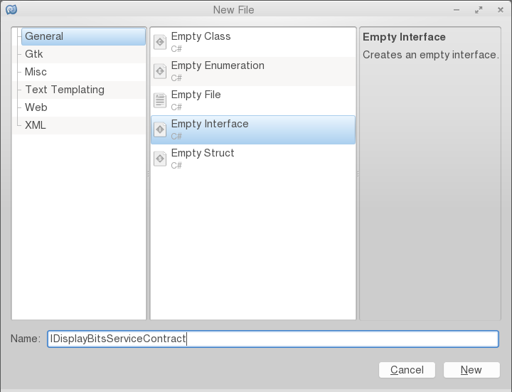

 

4-. Antes de escribir el código es importante agregar al proyecto la referencia al ensamblado <b>System.ServiceModel</b>

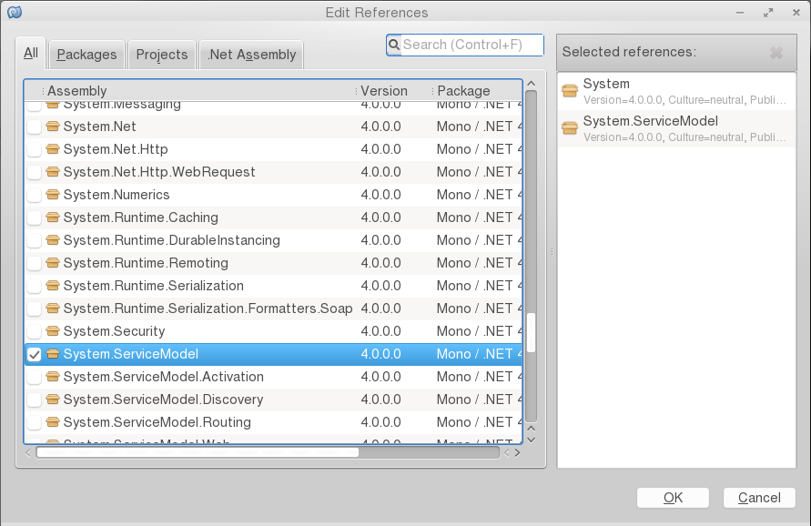

 

5- Escribir el código para la interfaz <i><b>IDisplayBitsServiceContract</b></i>:

6-. Escribir el código para la clase <i><b>DisplayBitsServiceImplementation</b></i>:

La solución debe de verse como en la siguiente imagen:

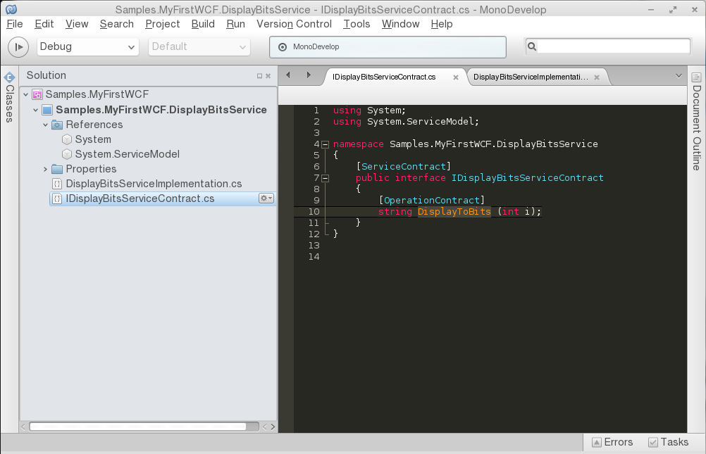

 
<h1>Tarea 2: Creación del programa Host</h1>

1-. Agrega un nuevo proyecto a la solución <b>Samples.MyFirstWCF</b> del tipo <b>Console Project</b> con el nombre de <b>Samples.MyFirstWCF.DisplayBitsSelfHost</b>.

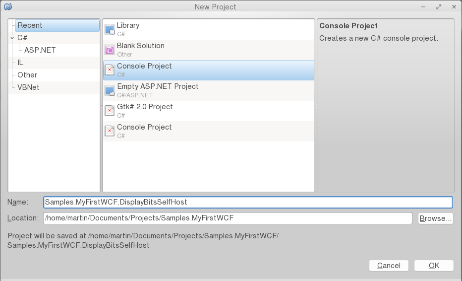

 

2-. Agrega una referencia al ensamblado <b>System.ServiceModel</b> y al proyecto <b>Samples.MyFirstWCF.DisplayBitsService</b>.

3-.Escribe el código dentro de la clase <b>MainClass</b>.

La solución debe de verse como en la siguiente imagen:

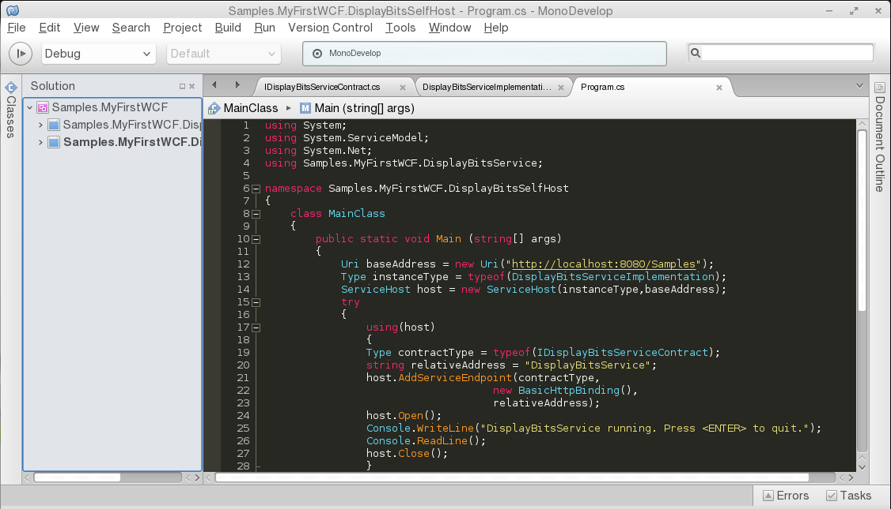

 
<h1><b>Paso 3: Creación del cliente GTK#</b></h1>

1-. Agrega un nuevo proyecto del tipo <b>GTK# 2.0 Project</b> con el nombre <b>Samples.MyFirstWCFClient</b>.

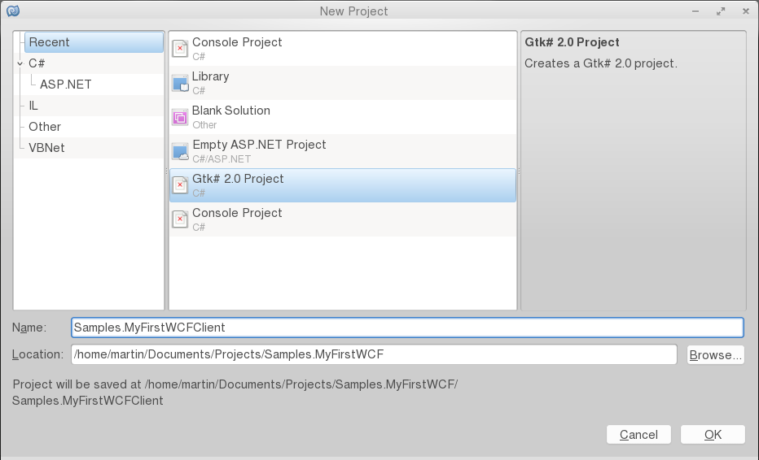

 

2-. Utilizando el diseñador de MonoDevelop creamos una interfaz gráfica como se muestra en la siguiente imagen:

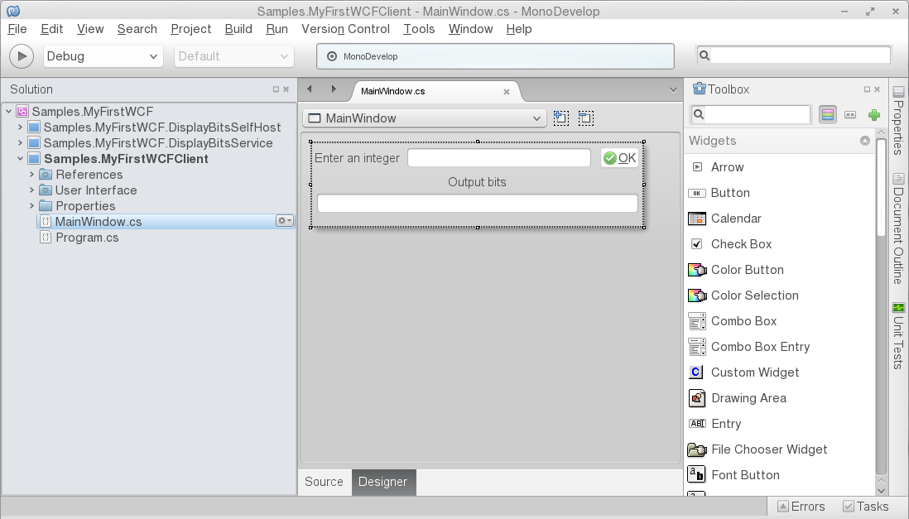

 

3-. Una aplicación cliente de WCF puede comunicarse con un servicio WCF utilizando una clase proxy. Para generar el código de esta clase, se utiliza la herramienta <b>svcutil (ServiceModel Metadata Utility Tool)</b>. 

4-. Abrimos una terminal y tecleamos el comando <b>svcutil</b>  utilizando como argumento el ensamblado del servicio y la opción <b>/out</b> para ponerle nombre al archivo y no utilizar el predeterminado.

<pre>
<b><tt>$ svcutil Samples.MyFirstWCF.DisplayBitsService.dll /out:ServiceBitsServiceReference.cs</tt></b>
</pre>

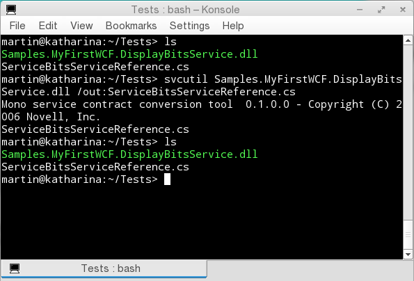

 

5-. Una vez generada la clase proxy, la agregamos a la solución <b>GTK#</b> para que la aplicación pueda invocar los métodos del servicio.

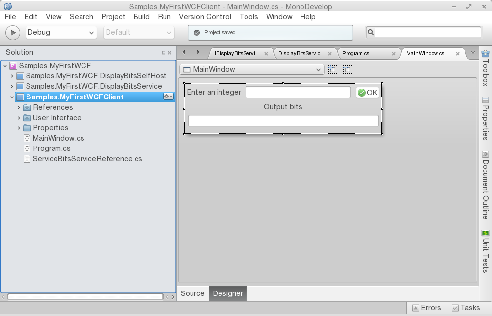

 
La clase proxy implementa un channel stack del lado del cliente. Todas las respuestas recibidas desde el servicio pasan a través de este stack, por lo que para comunicarse el cliente y el servicio deben utilizar un stack y una configuración equivalente.

6-. Antes de compilar es importante agregar una referencia al ensamblado <b>System.ServiceModel</b>.

7-. Ahora vamos a generar el código para utilizar el proxy, en la ventana <i><b>Properties</b></i>, busca dentro de la categoría <i><b>Button Signals</b></i> un evento llamado <i><b>clicked</b></i>, haz doble-click o pulsa enter para que MonoDevelop genere la plantilla para el evento.

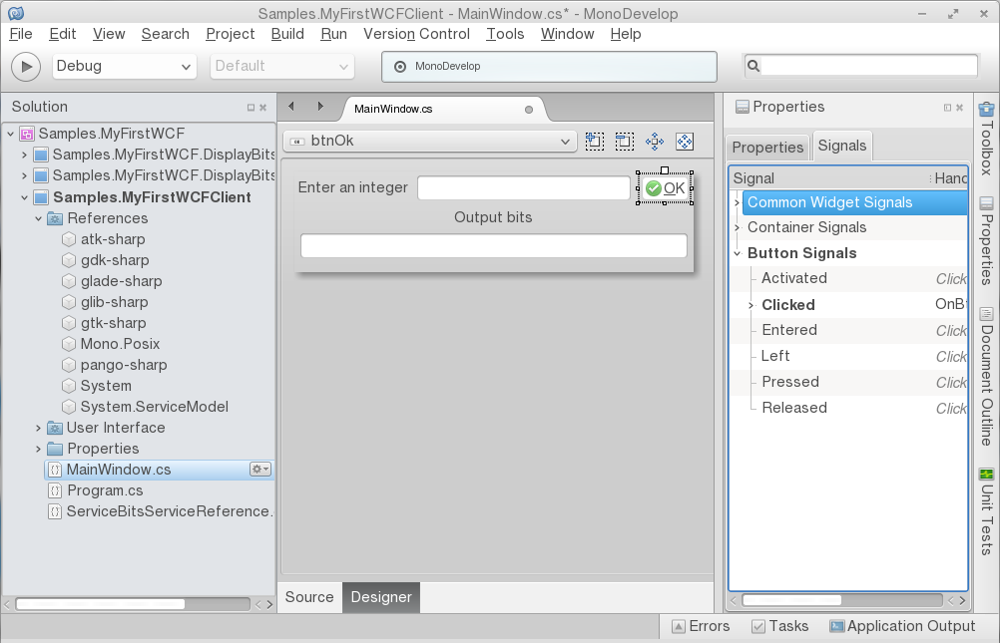

 

8-. Agrega el siguiente código para completar el método.

<!--Code-->

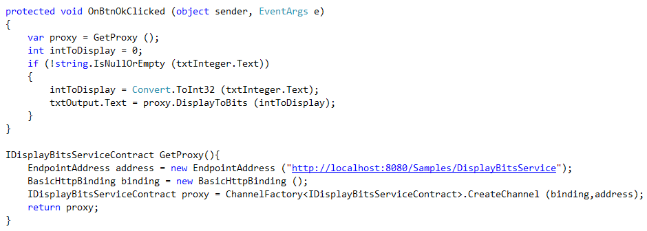

 
<!--Code-->

9- En el panel <i><b>Solution explorer</b></i>, haz click derecho en la solución <i><b>Samples.MyFirstWCF</b></i>, y entonces en el menú <i><b>Options</b></i>.

10- Configura la solución para que los proyectos <i><b>Samples.MyFirstWCF.DisplayBitsSelfHost</b></i> y <i><b>Samples.MyFirstWCFClient</b></i> empiecen cuando se ejecute la solución.

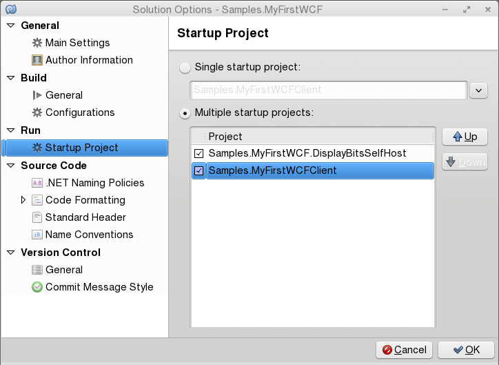

 

11-. Compila y ejecuta la solución, si todo está bien se verán las siguientes imágenes.

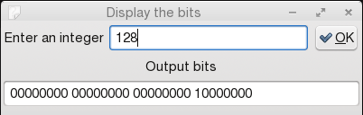

 

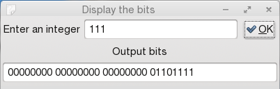

 

Al presionar el botón el cliente envía la petición al programa host y este le regresa el resultado correcto.

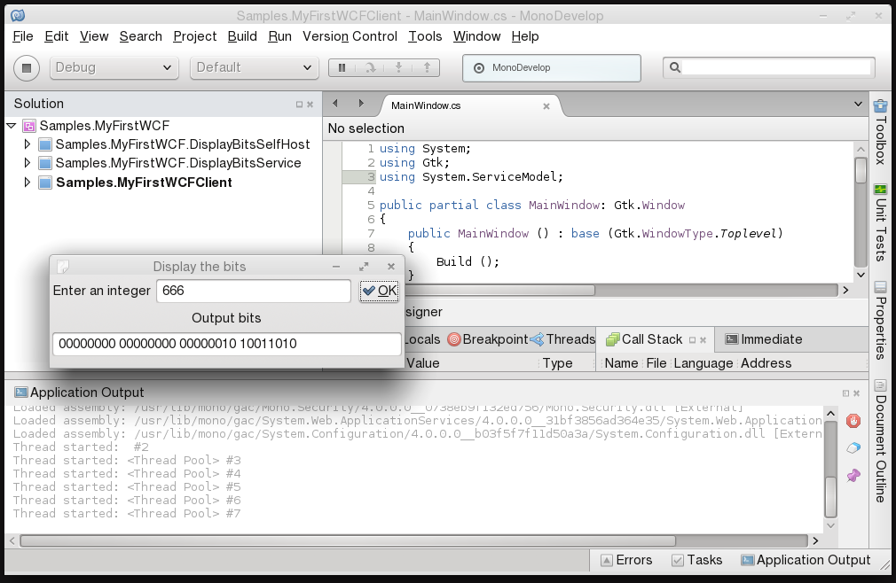

 
